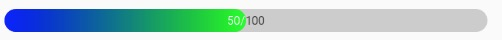

# ZProgressBar

> 带文本进度条，文字颜色随进度改变



```groovy

maven { url "http://maven.mjtown.cn/"}

compile "name.zeno:progressbar:0.0.1"
```

## [attrs](./library/src/main/res/values/attrs_ZprogressBar.xml)

## Thanks

- [ Android 自定义View-图片文字变色,实现酷炫LoadingView或者进度条](http://blog.csdn.net/u014702653/article/details/51999179)
  ```java
  FontMetricsInt fm = mPaint.getFontMetricsInt();
  int startY = getHeight() / 2 - fm.descent + (fm.bottom - fm.top) / 2;
  ```
- [android 实现文字渐变效果和歌词精度的效果](http://blog.csdn.net/u013278099/article/details/50881431)
